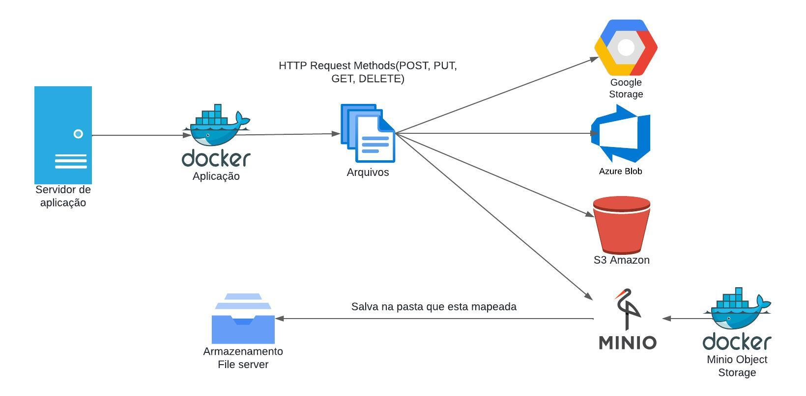

```

```

Armazenador de arquivos

O projeto feito em PHP tem o objetivo de permitir que arquivos sejam salvos em diversos provedores como Amazon S3, Azure, Google etc...`<br>`
Para teste estou usando o MinIO que é um Object Store capaz de armazenar arquivos e organizá-los em tags<> essa ferramenta é robusta e serve para ambientes em produção como uma solução de baixo custo e segura.`<br>`

O serviço MinIO está em um container Docker na nuvem e é acessado pela aplicação que salva, altera e exclui o arquivo.`<br>`

A aplicação conta com um arquivo index.php que permite cadastrar o proverdor com url login e senha, os dados são salvos em uma tabela no PostgreSql e a apicação consulta essa tabela para realizar a conexão com o Storage cadastrado.`<br>`

Arquitetura de armazenamento:


